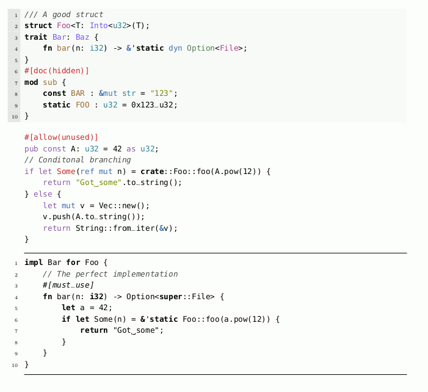

# listings-rust

A Rust language and style specification for the LaTeX-package [listings](https://ctan.org/pkg/listings).

See [demo.pdf](https://github.com/Cryptjar/listings-rust/releases/latest/download/demo.pdf) for a quick demo:

[](https://github.com/Cryptjar/listings-rust/releases/latest/download/demo.pdf)


## Usage

* generate the `listings-rust.sty`, or download it from the [latest release](https://github.com/Cryptjar/listings-rust/releases/latest/download/listings-rust.sty)
* place the `listings-rust.sty` where `latex` can find it
* import `listings-rust` in your LaTeX document with `\usepackage{listings-rust}`
* select the style `rust` in the `lstlistings` environment, e.g.
  ```latex
  \begin{lstlisting}[style=rust]
  // your source code
  \end{lstlisting}
  ```
* or select one of the alternative styles `rust-defs`, `rust-bw`, or mix it with further styling such `boxed` and `lined`, e.g.
  ```latex
  \begin{lstlisting}[style=rust-def, style=boxed]
  // your source code
  \end{lstlisting}
  ```


## Generate the style-file from source

The style-file is generated by directly extracting the Rust types from the Rust source code. Therefore, the official Rust repository is linked as sub-module, which needs to be initialized first:

```sh
git submodule init
git submodule update
```

Then the type names are extracted via the shell script `extract.sh`:

```sh
bash extract.sh
```

This will create the `std-names.toml` containing all the type names. With this file the template `listings-rust.sty.tpl` can be instantiate into the final `listings-rust.sty` via `tera` (install e.g. via `cargo install tera-cli`):

```sh
tera -f listings-rust.sty.tpl --toml std-names.toml > listings-rust.sty
```

This entire process (except installing `tera-cli`) can also be executed via Make:

```sh
make
```


## Documentation

Currently there is only the style-file itself and the example document `demo.tex` for documentation.


